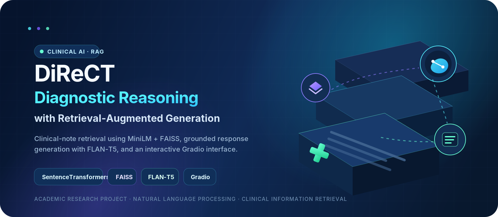
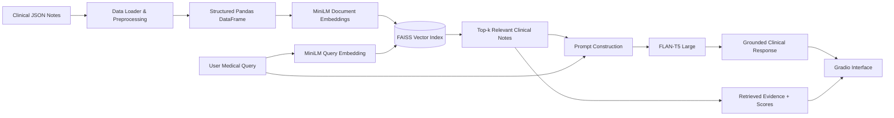

<h1 align="center">DiReCT — RAG for Diagnostic Reasoning on Clinical Notes</h1>

<p align="center">
  An end-to-end clinical Retrieval-Augmented Generation prototype that retrieves relevant patient-note context with <b>MiniLM + FAISS</b> and produces grounded natural-language responses with <b>FLAN-T5</b>.
</p>

<p align="center">
  
  
  
  
</p>

<p align="center">
  
  
  
  
</p>

<p align="center">
  
</p>


> [!IMPORTANT]
> This repository is an **academic research prototype**, not a medical device. Its outputs must not be used for diagnosis, treatment, emergency decisions, or direct patient care without review by qualified healthcare professionals.

---

## Table of Contents

- [Project Overview](#project-overview)
- [Why This Project](#why-this-project)
- [Core Features](#core-features)
- [System Architecture](#system-architecture)
- [End-to-End Workflow](#end-to-end-workflow)
- [Technology Stack](#technology-stack)
- [Dataset](#dataset)
- [Project Structure](#project-structure)
- [Getting Started](#getting-started)
- [Running the Notebook](#running-the-notebook)
- [Usage Examples](#usage-examples)
- [Evaluation](#evaluation)
- [Recorded Notebook Results](#recorded-notebook-results)
- [Current Limitations](#current-limitations)
- [Future Improvements](#future-improvements)
- [Responsible Use](#responsible-use)
- [Acknowledgements](#acknowledgements)

---

## Project Overview

**DiReCT** demonstrates how Retrieval-Augmented Generation can support diagnostic reasoning over structured clinical notes.

Instead of asking a language model to answer only from its pretrained knowledge, the system first searches a clinical-note collection for semantically relevant records. It then supplies the retrieved context to a sequence-to-sequence language model, allowing the final response to be grounded in the available evidence.

The notebook implements the complete pipeline:

1. Load and preprocess clinical JSON records.
2. Convert notes into dense vector embeddings.
3. Build a FAISS similarity-search index.
4. Retrieve the most relevant notes for a medical query.
5. Generate a context-aware response with FLAN-T5.
6. Present results through an interactive Gradio interface.
7. Measure retrieval speed, relevance, precision, recall, and answer quality.

---

## Why This Project

Clinical records are long, unstructured, and difficult to search using exact keywords alone. The same condition may be described with abbreviations, symptoms, medications, or related terminology.

This project combines two complementary components:

| Component | Purpose |
|---|---|
| **Dense Retrieval** | Finds semantically related clinical notes even when exact words differ. |
| **Text Generation** | Converts the retrieved evidence into a readable response for the user. |

The result is a transparent pipeline in which users can inspect both the generated answer and the source notes retrieved for that answer.

---

## Core Features

### Clinical Data Processing

- Recursively reads JSON files from the MIMIC-IV-Ext DiReCT dataset.
- Extracts diagnosis labels from the dataset key structure.
- Organizes chief complaint, history, treatment, and note text into a Pandas DataFrame.
- Filters incomplete records before indexing.
- Exports processed notes and retrieval results for later analysis.

### Semantic Retrieval

- Uses `sentence-transformers/all-MiniLM-L6-v2` to encode notes and user queries.
- Normalizes embeddings for cosine-similarity-style comparison.
- Uses `faiss.IndexFlatIP` for efficient inner-product search.
- Returns top-k documents with metadata and relevance scores.

### Grounded Response Generation

- Uses `google/flan-t5-large` through Hugging Face Transformers.
- Combines retrieved note excerpts into a compact context window.
- Generates a natural-language answer from the query and retrieved evidence.
- Preserves retrieved documents and scores alongside each response.

### Interactive User Interface

- Provides a Gradio text interface for medical questions.
- Normalizes selected query patterns such as diabetes, stroke, asthma, and sepsis.
- Displays the detected disease label, generated response, document excerpts, and similarity scores.

### Evaluation and Analysis

- Measures average retrieval duration.
- Calculates average similarity scores across test queries.
- Includes semantic precision and recall evaluation logic.
- Includes model-based answer scoring for relevance, coherence, and accuracy.

---

## System Architecture



### Retrieval-to-Generation Flow

```text
User Query
   │
   ▼
Query Embedding ─────────────┐
                             ▼
Clinical Notes → Embeddings → FAISS Search
                             │
                             ▼
                   Top-k Relevant Records
                             │
                             ▼
                    Context-Rich Prompt
                             │
                             ▼
                       FLAN-T5 Large
                             │
                             ▼
          Generated Answer + Evidence + Scores
```

---

## End-to-End Workflow

| Stage | Implementation | Output |
|---|---|---|
| **1. Extraction** | Unpacks the clinical dataset archive. | Directory of clinical JSON files. |
| **2. Loading** | Walks through directories and reads each JSON document. | Raw record dictionaries. |
| **3. Preprocessing** | Builds combined document text from diagnosis, complaint, history, treatment, and notes. | `notes_df` DataFrame. |
| **4. Embedding** | Encodes documents with MiniLM. | Dense `float32` vectors. |
| **5. Indexing** | Adds normalized vectors to `faiss.IndexFlatIP`. | Searchable vector index. |
| **6. Retrieval** | Encodes a query and retrieves top-k records. | Documents, metadata, and scores. |
| **7. Generation** | Sends the query and retrieved context to FLAN-T5. | Natural-language response. |
| **8. Interface** | Formats output in Gradio Markdown. | Interactive web demo. |
| **9. Evaluation** | Measures speed, similarity, retrieval quality, and generated-answer quality. | Experimental metrics. |

---

## Technology Stack

| Category | Technology | Role |
|---|---|---|
| Language | Python | Complete project implementation. |
| Environment | Jupyter Notebook / Google Colab | Experimentation and execution. |
| Data Handling | Pandas, JSON, OS | Loading, structuring, filtering, and exporting records. |
| Numerical Computing | NumPy | Embedding conversion and metric calculations. |
| Embedding Model | `all-MiniLM-L6-v2` | Dense semantic representation of notes and queries. |
| Vector Database | FAISS CPU | Fast top-k similarity retrieval. |
| Generator | `google/flan-t5-large` | Context-conditioned response generation. |
| Deep Learning | PyTorch | Model execution on CPU or CUDA. |
| NLP Framework | Hugging Face Transformers | Tokenizer and model loading. |
| Application UI | Gradio | Interactive question-answering interface. |

---

## Dataset

The notebook is designed around the **MIMIC-IV-Ext DiReCT** clinical-note dataset stored as JSON files.

Each processed record contains:

```text
document_id
├── document_text
├── chief_complaint
├── history
├── diagnosis
└── treatment
```

The combined `document_text` follows this general structure:

```text
Diagnosis: ... | Complaint: ... | History: ... | Treatment: ... | Notes: ...
```

### Dataset Placement

The notebook expects an archive at:

```text
/content/mimic-iv-ext-direct-1.0.0.rar
```

After extraction, update `data_path` so it points to the directory containing the JSON files:

```python
data_path = "/content/mimic-iv-ext-direct-1.0.0/"
```

> [!NOTE]
> In the recorded notebook run, the file had a `.rar` extension but was identified by the system as a ZIP archive. Verify the archive type before choosing `unzip`, `unrar`, or `7z`.

> [!WARNING]
> Clinical datasets may require authorization, training, data-use agreements, and secure handling. Do not upload restricted patient data to a public repository.

---

## Project Structure

```text
clinical-rag-direct/
├── RAG_Code.ipynb
├── README.md
├── assets/
│   └── clinical-rag-3d-banner.png
├── data/                       # Not committed; place authorized data here
├── processed_notes.csv         # Generated by the notebook
└── results.json                # Generated retrieval results
```

---

## Getting Started

### Prerequisites

- Python 3.10 or newer
- Jupyter Notebook, JupyterLab, or Google Colab
- At least 8 GB RAM recommended
- Additional memory is recommended for `google/flan-t5-large`
- CUDA-capable GPU recommended for faster generation, but not required
- Authorized access to the clinical dataset

### 1. Clone the Repository

```bash
git clone <your-repository-url>
cd clinical-rag-direct
```

### 2. Create a Virtual Environment

#### Linux / macOS

```bash
python3 -m venv .venv
source .venv/bin/activate
```

#### Windows PowerShell

```powershell
python -m venv .venv
.venv\Scripts\Activate.ps1
```

### 3. Install Dependencies

```bash
python -m pip install --upgrade pip
pip install \
  jupyter \
  pandas \
  numpy \
  sentence-transformers \
  faiss-cpu \
  transformers \
  torch \
  gradio
```

For reproducible research, pin the tested package versions in a `requirements.txt` file before final deployment.

### 4. Prepare the Dataset

Place the authorized dataset archive or extracted JSON directory in your preferred data location. Then update the notebook variable:

```python
data_path = "./data/mimic-iv-ext-direct-1.0.0/"
```

---

## Running the Notebook

### Local Jupyter

```bash
jupyter notebook RAG_Code.ipynb
```

Run the cells in this order:

1. Install/import dependencies.
2. Extract and inspect the dataset.
3. Load and preprocess JSON records.
4. Build the MiniLM embeddings and FAISS index.
5. Test retrieval queries.
6. Load FLAN-T5 and initialize the enhanced RAG system.
7. Launch the Gradio interface.
8. Run evaluation cells.

### Google Colab

1. Upload `RAG_Code.ipynb` to Colab.
2. Select **Runtime → Change runtime type → GPU** when available.
3. Upload or securely mount the authorized dataset.
4. Update the archive and data paths.
5. Run all cells in order.

For Gradio in Colab, use:

```python
ui.launch(share=True, debug=True)
```

---

## Usage Examples

### Retrieve Relevant Documents

```python
results = retriever.retrieve("stroke symptoms", top_k=3)

for rank, (document, metadata, score) in enumerate(results, start=1):
    print(f"{rank}. Score: {score:.3f}")
    print(f"Diagnosis: {metadata.get('diagnosis', 'N/A')}")
    print(f"Excerpt: {document[:200]}...")
```

### Query the Enhanced RAG System

```python
result = enhanced_rag.query("asthma management", top_k=3)

print(result["response"])
print(result["retrieved_documents"])
```

### Example Questions

```text
What are common stroke symptoms?
How is severe asthma managed?
What treatments are associated with sepsis?
What signs appear in Type II diabetes records?
What clinical information is relevant to hypertension?
```

### Response Object

```json
{
  "query": "stroke symptoms",
  "response": "Generated response based on retrieved notes",
  "retrieved_documents": [
    {
      "text": "Clinical note text",
      "metadata": {
        "diagnosis": "Ischemic Stroke",
        "chief_complaint": "...",
        "history": "...",
        "treatment": "..."
      },
      "score": 0.53
    }
  ],
  "timestamp": "ISO-8601 timestamp"
}
```

---

## Evaluation

### Retrieval Speed

The notebook executes repeated FAISS searches and calculates the mean duration:

```python
execution_times = []
for _ in range(10):
    start = time.time()
    retriever.retrieve("test", 5)
    execution_times.append(time.time() - start)
```

### Average Relevance Score

Similarity scores from retrieved documents are aggregated across sample queries:

```python
all_scores = [
    item["score"]
    for result in query_results
    for item in result["retrieved_documents"]
]
mean_score = np.mean(all_scores)
```

### Semantic Precision and Recall

The notebook contains an experimental evaluator that treats records above an embedding-similarity threshold as relevant.

Before using it, add the expected columns:

```python
notes_df = notes_df.reset_index(drop=True)
notes_df["row_id"] = notes_df.index
notes_df["clean_text"] = notes_df["document_text"].fillna("")
```

Then evaluate retrieval:

```python
precision, recall = evaluate_retrieval_semantic(
    query=query,
    retrieved_docs=retrieved_docs,
    full_df=notes_df,
    embed_model=retriever.model,
    threshold=0.40,
)
```

### Generated-Answer Evaluation

A model-based evaluator asks the generator to score each answer from 1 to 5 on:

- Relevance
- Coherence
- Accuracy

This is useful for experimentation but is **not equivalent to evaluation by clinicians or medical experts**.

---

## Recorded Notebook Results

The uploaded notebook contains the following values from one experimental run:

| Metric | Recorded Value | Interpretation |
|---|---:|---|
| Documents processed | **1,046** | Clinical JSON records loaded into the DataFrame. |
| Documents after filtering | **1,046** | All loaded records passed the notebook's current filter. |
| Average retrieval duration | **0.0065 seconds** | Mean FAISS search time over ten repeated test queries. |
| Average relevance score | **0.496** | Mean similarity score across the notebook's sample query set. |

> [!CAUTION]
> These values are execution results from one notebook run, not a validated clinical benchmark. Results will vary with hardware, preprocessing, dataset version, query set, and package versions.

---

## Current Limitations

- The system is a research prototype and has not been clinically validated.
- Generated responses may be incomplete, incorrect, or hallucinated.
- The current prompt truncates each retrieved document to a short excerpt.
- `google/flan-t5-large` is resource-intensive and may run slowly on CPU.
- Query normalization currently contains explicit shortcuts for only a few conditions.
- Similarity scores are not medical confidence scores.
- The semantic evaluator uses model-derived relevance rather than expert annotations.
- The answer evaluator uses the same generator family and may introduce evaluation bias.
- The notebook's evaluation function expects `clean_text` and `row_id` columns, which must be added before execution.
- Data access, privacy, bias, fairness, and security controls require additional work before any real-world use.

---

## Future Improvements

- [ ] Add chunking for long clinical notes instead of fixed character truncation.
- [ ] Introduce a cross-encoder reranker after FAISS retrieval.
- [ ] Add source citations directly inside generated answers.
- [ ] Persist and reload the FAISS index from disk.
- [ ] Add deterministic test cases for preprocessing and retrieval.
- [ ] Add clinician-reviewed ground-truth queries and relevance labels.
- [ ] Evaluate with Precision@K, Recall@K, MRR, nDCG, ROUGE, and factuality metrics.
- [ ] Compare MiniLM with biomedical embedding models.
- [ ] Compare FLAN-T5 with domain-specific medical language models.
- [ ] Add guardrails for emergency, harmful, or unsupported medical requests.
- [ ] Containerize the application with Docker.
- [ ] Deploy a controlled demo using Hugging Face Spaces or another secure platform.

---

## Responsible Use

This project should be used only for learning, controlled experimentation, and approved research.

Do not use it to:

- Diagnose a patient.
- Recommend medication or treatment.
- Replace professional medical judgment.
- Process restricted clinical data without authorization.
- Publish protected or identifiable patient information.
- Make high-stakes clinical decisions.

Any real-world extension should include expert review, privacy controls, audit logging, dataset governance, model monitoring, bias evaluation, security testing, and compliance with applicable healthcare regulations.

---

## Acknowledgements

This academic project builds upon open-source tools and research ecosystems maintained by:

- Hugging Face for Transformers and SentenceTransformers.
- Meta AI Research for FAISS.
- Google Research for FLAN-T5.
- Gradio for the interactive machine-learning interface.
- The maintainers and authorized providers of the MIMIC-IV-Ext DiReCT dataset.

Dataset access conditions and model licenses remain governed by their respective owners.

---

<p align="center">
  <b>Built for academic exploration of clinical information retrieval and grounded language generation.</b>
</p>

<p align="center">
  ⭐ Star the repository if this project helps your learning or research.
</p>
